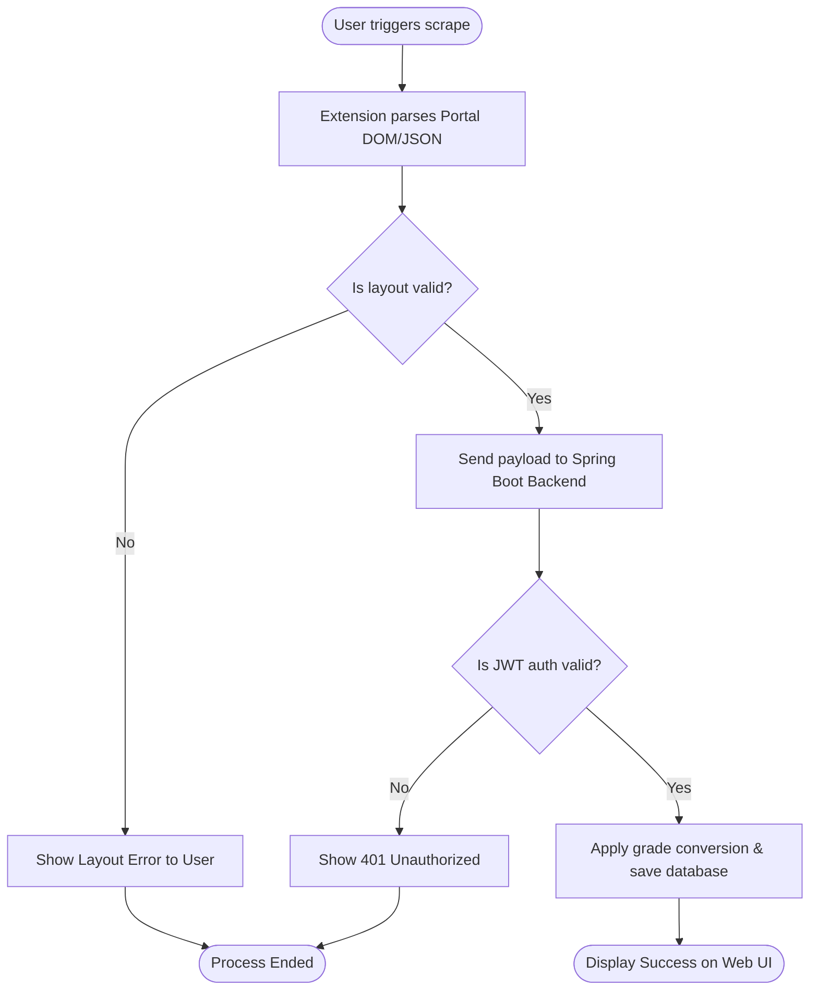

# BPMN Workflow & Business Process Specification — UniGPA

| Field | Value |
| :--- | :--- |
| Process ID/version | `GPA-BPMN-001` / `1.0` |
| Owner/reviewer | AI Business Analyst / Client |
| Requirements | `FR-GPA-001`, `FR-GPA-002` |
| Machine-readable BPMN | N/A |

## Process Inventory

| Process ID | Name/trigger | Start/end event | Lanes/roles | SLA | Main outcome | Exception outcome | Requirements/tests |
| :--- | :--- | :--- | :--- | :--- | :--- | :--- | :--- |
| `BPMN-001` | Scrape Academic Records / Clicks Scrape | Logged in on Portal ➔ Sync Success | Student / Extension / Backend | < 30 seconds | Transcript saved & displayed | Parsing error shown to user | `FR-GPA-001`, `FR-GPA-002` / `TC-SMOKE-001` |

## Flow Model

## Task and Gateway Catalog

| Element ID | BPMN type | Lane/actor | Input/output | Rule/permission | Timeout/retry | Audit/event | Requirement/test |
| :--- | :--- | :--- | :--- | :--- | :--- | :--- | :--- |
| `TASK-001` | Service Task / Parse DOM | Chrome Extension | HTML Portal DOM ➔ JSON Payload | Scrape active session | 10 seconds | Parsing trigger event | `FR-GPA-001` / `TC-SCRAPE-01` |
| `TASK-002` | Service Task / Save Data | Spring Boot Backend | JSON Payload ➔ MySQL DB rows | JWT Token Auth | 5 seconds / 3 retries | Transcript sync log | `FR-GPA-002` / `TC-DB-01` |

## Message, Data and Exception Flow

| Flow ID | From → to | Message/data | Trust boundary | Idempotency/correlation | Failure/compensation | Verification |
| :--- | :--- | :--- | :--- | :--- | :--- | :--- |
| `MSG-GPA-001` | Chrome Extension → Backend API | POST `/api/transcripts` | Browser to Server HTTPS | Payload hash check | Abort transaction | `TC-INT-001` |

## Gate Evidence

- [x] Every start/end event has a measurable outcome.
- [x] Every gateway condition maps to a business rule.
- [x] Every user/service task maps to an actor and permission.
- [x] Error, timeout, retry, compensation and audit paths have tests.
- [x] BPMN XML or equivalent machine-readable artifact validates before Gate 02.
