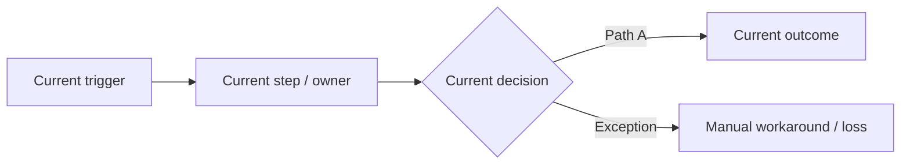
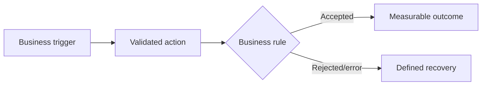

# Business Requirements Document (BRD) — {{PROJECT_NAME}}

| Trường | Giá trị |
| :--- | :--- |
| Document ID | `{{PROJECT_CODE}}-BRD-001` |
| Version / status | {{VERSION}} / {{STATUS}} |
| Business owner / approver | {{PRODUCT_OWNER}} / {{CLIENT_APPROVER}} |
| Linked discovery baseline | {{DISCOVERY_BASELINE}} |

## Version history

| Version | Date | Author | Change reason | Sections/IDs affected | Approver |
| :--- | :--- | :--- | :--- | :--- | :--- |
| 0.1 | {{DATE}} | {{AUTHOR}} | Initial draft | All | Pending |

## Glossary and canonical terminology

| Term/acronym | Canonical definition | Allowed alias | Forbidden/ambiguous alias | Owner/source |
| :--- | :--- | :--- | :--- | :--- |
| {{TERM}} | {{DEFINITION}} | {{ALIAS_OR_NONE}} | {{FORBIDDEN_ALIAS}} | {{OWNER_SOURCE}} |

## 1. Executive business need

- Problem/opportunity: {{PROBLEM_STATEMENT}}
- Affected stakeholders/users: {{STAKEHOLDERS}}
- Current measurable impact/baseline: {{BASELINE_IMPACT}}
- Desired outcome and deadline: {{OUTCOME_TARGET_DATE}}
- Cost of inaction: {{COST_OF_INACTION}}

## 2. Scope

| In scope | Out of scope | Future consideration |
| :--- | :--- | :--- |
| {{IN_SCOPE}} | {{OUT_OF_SCOPE}} | {{FUTURE_SCOPE}} |

## 3. Stakeholder and decision rights

| STK ID | Stakeholder/role | Need/concern | Decision/approval right | Success measure |
| :--- | :--- | :--- | :--- | :--- |
| STK-001 | {{STAKEHOLDER}} | {{NEED}} | {{RIGHT}} | {{MEASURE}} |

## 4. As-is workflow

| Step | Actor | Input | Action/rule | Output | Pain/evidence |
| :--- | :--- | :--- | :--- | :--- | :--- |
| ASIS-01 | {{ACTOR}} | {{INPUT}} | {{ACTION_RULE}} | {{OUTPUT}} | {{PAIN_EVIDENCE}} |

## 5. To-be workflow

| Step | Actor/system | Trigger/precondition | Required behavior | Outcome/state | Linked BR/Feature |
| :--- | :--- | :--- | :--- | :--- | :--- |
| TOBE-01 | {{ACTOR}} | {{TRIGGER}} | {{BEHAVIOR}} | {{OUTCOME_STATE}} | BR/FEAT-XXX |

## 6. Business objectives and KPIs

| OBJ ID | Objective | Baseline | Target/window | Measurement source/method | Owner |
| :--- | :--- | :--- | :--- | :--- | :--- |
| OBJ-001 | {{OBJECTIVE}} | {{BASELINE}} | {{TARGET_WINDOW}} | {{METHOD}} | {{OWNER}} |

## 7. Business requirements and rules

| BR ID | Requirement/rule | Source | Priority | Rationale | Measurable acceptance |
| :--- | :--- | :--- | :--- | :--- | :--- |
| BR-001 | Client/business **phải** {{REQUIREMENT}} | Q-Cxxx / STK-xxx | Must | {{RATIONALE}} | {{ACCEPTANCE}} |

## 8. Feature summary

| Feature ID | Feature | Business outcome | Primary actors | Priority/release | Linked BR/UC |
| :--- | :--- | :--- | :--- | :--- | :--- |
| FEAT-XXX-001 | {{FEATURE}} | {{OUTCOME}} | {{ACTORS}} | Must / REL-XXX | BR/UC-XXX |

Chi tiết và complexity/risk nằm tại `FEATURE_CATALOG.md`.

## 9. Constraints, assumptions and dependencies

| ID | Type | Statement | Owner/validation date | Impact/fallback |
| :--- | :--- | :--- | :--- | :--- |
| CON/ASM/DEP-001 | {{TYPE}} | {{STATEMENT}} | {{OWNER_DATE}} | {{IMPACT_FALLBACK}} |

## 10. Business acceptance

- Release acceptance authority: {{CLIENT_APPROVER}}
- Business/UAT scenarios: {{UAT_IDS}}
- Minimum KPI/quality threshold: {{THRESHOLDS}}
- Blocking exclusions/risks: {{RISKS}}

## 11. External interface summary

| Interface category | Business need/constraint | Detailed requirement/reference | Owner |
| :--- | :--- | :--- | :--- |
| User Interface | {{NEED}} | UI-REQ-XXX / DES-UI-XXX | {{OWNER}} |
| Hardware Interface | {{NEED_OR_NA_RATIONALE}} | HW-REQ-XXX / N/A | {{OWNER}} |
| Software Interface/API | {{NEED}} | INT/API-XXX | {{OWNER}} |
| Communications Interface | {{NETWORK_SECURITY_NEED}} | COM-REQ-XXX | {{OWNER}} |

## 12. Sign-off

| Role | Decision | Date | Conditions |
| :--- | :--- | :--- | :--- |
| Client Product Owner | Pending / Approved / Rejected | {{DATE}} | {{CONDITIONS}} |
| Vendor BA/Delivery Lead | Pending / Approved / Rejected | {{DATE}} | {{CONDITIONS}} |
