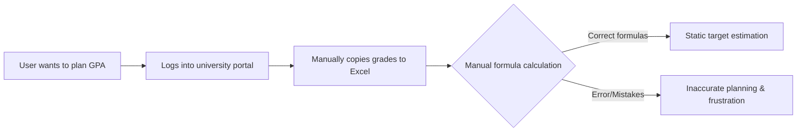
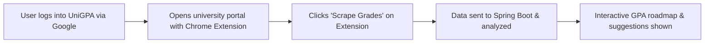

# Business Requirements Document (BRD) — UniGPA

| Field | Value |
| :--- | :--- |
| Document ID | `GPA-BRD-001` |
| Version / status | 1.0 / Approved |
| Business owner / approver | Client / Client |
| Linked discovery baseline | [DISCOVERY_LOG.md](file:///e:/template_BRD/AI_PROJECT_LIFECYCLE_TEMPLATE/01-Planning/DISCOVERY_LOG.md) (Approved 2026-07-18) |

## Version History

| Version | Date | Author | Change reason | Sections/IDs affected | Approver |
| :--- | :--- | :--- | :--- | :--- | :--- |
| 1.0 | 2026-07-18 | AI Business Analyst | Initial version after discovery baseline approval | All | Client |

## Glossary and Canonical Terminology

| Term/acronym | Canonical definition | Allowed alias | Forbidden/ambiguous alias | Owner/source |
| :--- | :--- | :--- | :--- | :--- |
| GPA | Grade Point Average, cumulative academic performance index on a 4.0 scale. | Cumulative GPA | Academic score | MoET Standard |
| SIS | Student Information System, represents university student portal. | Portal | University web | FPT / NEU |
| Scraper | Chrome extension component that extracts student transcripts from portals. | Crawler | Scraper plugin | AI Delivery Vendor |
| Roadmap | Projected list of semesters and courses toward graduation goals. | Study Plan | Graduation pathway | Product Owner |
| Leaderboard | Anonymous ranking system comparing GPA percentiles. | Ranking | Scoreboard | Product Owner |

## 1. Executive Business Need

- **Problem/opportunity:** University students in Vietnam struggle to calculate their GPA accurately, track progress, or understand what grades they need in remaining courses to meet their target GPA, leading to a lack of academic goals and motivation.
- **Affected stakeholders/users:** University students in Vietnam (specifically FPT and NEU in the MVP phase).
- **Current measurable impact/baseline:** Students manually copy grades to Excel files, which is error-prone, takes 15–30 minutes, and lacks planning or predictive grade suggestion mechanisms.
- **Desired outcome and deadline:** An intuitive platform where students import transcripts via a Chrome Extension in under 1 minute, set GPA targets, and receive suggested grades for future courses. No fixed deadline.
- **Cost of inaction:** Low academic performance, missed scholarship opportunities, delays in graduation, or dropouts.

## 2. Scope

| In Scope | Out of Scope | Future Consideration |
| :--- | :--- | :--- |
| - Chrome Extension to scrape transcript/curriculum from FPT (FAP) and NEU (credit page) portals using DOM scraping & API interception. - React JS Web app to manage study roadmap, simulate grades. - Hybrid grade suggestion algorithm (subject difficulty + past performance). - Anonymous leaderboards based on percentile ranking by major and intake year. - Support storing multiple simulated transcripts under a single account. - Google OAuth 2.0 login and account persistence. | - Automatically storing students' university portal passwords on the backend. - Periodically scraping in the background without active user sessions. - Supporting other universities outside FPT and NEU. | - Supporting other major universities (HUST, VNU, etc.). - Mobile App. - Integrating study group systems or suggesting study materials based on subjects needing improvement. |

## 3. Stakeholder and Decision Rights

| STK ID | Stakeholder/role | Need/concern | Decision/approval right | Success measure |
| :--- | :--- | :--- | :--- | :--- |
| STK-001 | University Students | Need a quick way to import grades and plan targets without risking account security. | End users / feedback provider. | Import completed in < 1 min; clear roadmap generated. |
| STK-002 | Product Owner (Client) | Needs an enterprise-grade, secure, and resilient system aligned with standards. | Final approval on requirements, architecture, and release. | 100% requirements traced and pass verification gates. |

## 4. As-Is Workflow

| Step | Actor | Input | Action/rule | Output | Pain/evidence |
| :--- | :--- | :--- | :--- | :--- | :--- |
| ASIS-01 | Student | Portal account credentials | Log into FPT (FAP) or NEU portal and locate the grades page. | Grade tables displayed on screen. | Complex navigation, session timeouts. |
| ASIS-02 | Student | HTML screen | Copy-paste tables to local MS Excel file. | Raw spreadsheet data. | Formatting errors, missing subject credits, takes 15+ minutes. |
| ASIS-03 | Student | Spreadsheet | Apply custom formulas to calculate cumulative GPA. | Estimated target GPA. | Math errors, lack of standard conversion formulas, no automatic grade target suggestions. |

## 5. To-Be Workflow

| Step | Actor/system | Trigger/precondition | Required behavior | Outcome/state | Linked BR/Feature |
| :--- | :--- | :--- | :--- | :--- | :--- |
| TOBE-01 | Chrome Extension | User opens the grades page on FPT/NEU portal and clicks "Scrape". | Scrape DOM table and intercept JSON grade responses. Validate integrity. | Transcripts extracted as raw payload. | `FR-GPA-001` |
| TOBE-02 | Spring Boot Backend | Extension sends parsed transcript payload. | Validate payload, parse subjects, apply conversion mappings, and store. | Transcript saved under student profile. | `FR-GPA-006`, `BR-GPA-001` |
| TOBE-03 | Web App (React) | User navigates to Roadmap / Simulator page. | Display current cumulative GPA, visual progress, and editable target suggestions. | Interactive dashboard populated. | `FR-GPA-002`, `FR-GPA-003` |

## 6. Business Objectives and KPIs

| OBJ ID | Objective | Baseline | Target/window | Measurement source/method | Owner |
| :--- | :--- | :--- | :--- | :--- | :--- |
| OBJ-GPA-001 | Successful Grade Import | Manual copy (15 mins) | < 1 minute to import via Chrome Extension. | Scraper execution logs and timer. | Tech Lead |
| OBJ-GPA-002 | Suggested Grade Precision | No automation | Suggetions must calculate mathematically exact required grades to reach target GPA. | Unit tests validating core math. | Tech Lead |
| OBJ-GPA-003 | Major Ranking Precision | No ranking | Anonymous percentiles calculated within matching Major & Intake Year. | SQL aggregation and test verification. | QA Lead |

## 7. Business Requirements and Rules

| BR ID | Requirement/rule | Source | Priority | Rationale | Measurable acceptance |
| :--- | :--- | :--- | :--- | :--- | :--- |
| `BR-GPA-001` | The system **SHALL** convert grades according to specified FPT and NEU conversion tables. | Client / OQ-GPA-009 | Must | Ensures calculations match official transcripts. | FPT: 8.5+ -> A(4), 7.0+ -> B(3), etc. NEU: 8.5+ -> A(4), 8.0+ -> B+(3.5), etc. |
| `BR-GPA-002` | Leaderboard comparison **SHALL** only group users of the same Major and Intake Year. | Client / OQ-GPA-011 | Must | Ensures fair ranking between peers. | Query contains: `major_code = X AND intake_year = Y`. |
| `BR-GPA-003` | The system **SHALL NOT** store student university portal passwords. | Client / OQ-GPA-013 | Must | Minimizes security liability and privacy risk. | No password field in DB or API requests for scraper. |
| `BR-GPA-004` | A student user **SHALL** be permitted to save multiple transcripts/simulations under one account. | Client / OQ-GPA-013 | Must | Allows tracking different scenarios or degrees. | One-to-many relationship between User and Transcript. |

## 8. Feature Summary

| Feature ID | Feature | Business outcome | Primary actors | Priority/release | Linked BR/UC |
| :--- | :--- | :--- | :--- | :--- | :--- |
| `FEAT-GPA-001` | SIS Scraper (Chrome Extension) | Fast, automated transcript import. | Student | Must / REL-1.0 | `FR-GPA-001` |
| `FEAT-GPA-002` | GPA Planner & Simulator | Interactive goal-setting and target grade suggestions. | Student | Must / REL-1.0 | `FR-GPA-002`, `FR-GPA-004` |
| `FEAT-GPA-003` | Major Percentile Leaderboard | Motivates students by ranking them anonymized. | Student | Must / REL-1.0 | `FR-GPA-005` |
| `FEAT-GPA-004` | Multi-Transcript Storage | Persistence of various simulation tracks. | Student | Must / REL-1.0 | `FR-GPA-007` |

Details and complexity/risk are located in [FEATURE_CATALOG.md](FEATURE_CATALOG.md).

## 9. Constraints, Assumptions and Dependencies

| ID | Type | Statement | Owner/validation date | Impact/fallback |
| :--- | :--- | :--- | :--- | :--- |
| `CON-GPA-001` | Tech Stack | React JS frontend, Spring Boot backend, MySQL DB, Chrome Extension. | Client / 2026-07-18 | Must implement using these technologies. |
| `ASM-GPA-001` | Session-based Scraping | Scraper only runs while the student is logged in. | Tech Lead / 2026-07-18 | Scraper fails if portal changes login structure; require extension update. |
| `DEP-GPA-001` | Portal stability | Scraper depends on NEU and FPT grade page layouts. | AI Vendor / 2026-07-18 | If portal layout changes, scraping fails; fallback is manual grade input. |

## 10. Business Acceptance

- **Release acceptance authority:** Client Product Owner.
- **Business/UAT scenarios:** Grade crawling, GPA target suggestion math, multi-profile switching, leaderboard ranking.
- **Minimum KPI/quality threshold:** 100% correct GPA math; scraper works on clean portals; Google auth success.
- **Blocking exclusions/risks:** Inability to scrape due to portal IP blocking or CAPTCHA (mitigated by running extension client-side under user's IP).

## 11. External Interface Summary

| Interface Category | Business Need/Constraint | Detailed Requirement/Reference | Owner |
| :--- | :--- | :--- | :--- |
| User Interface | Student dashboard & chrome popup | React JS UI screens, Chrome Extension popups | Product Owner |
| Hardware Interface | N/A | N/A | — |
| Software Interface/API | Scraper payload exchange, Google OAuth | Spring Boot JSON REST API | Tech Lead |
| Communications Interface | Secure data transfer | HTTPS over TLS 1.2+ for all API communication | Security Lead |

## 12. Sign-Off

| Role | Decision | Date | Conditions |
| :--- | :--- | :--- | :--- |
| Client Product Owner | Approved | 2026-07-18 | Final baseline approved |
| Vendor BA/Delivery Lead | Approved | 2026-07-18 | discovery matches requirements |
