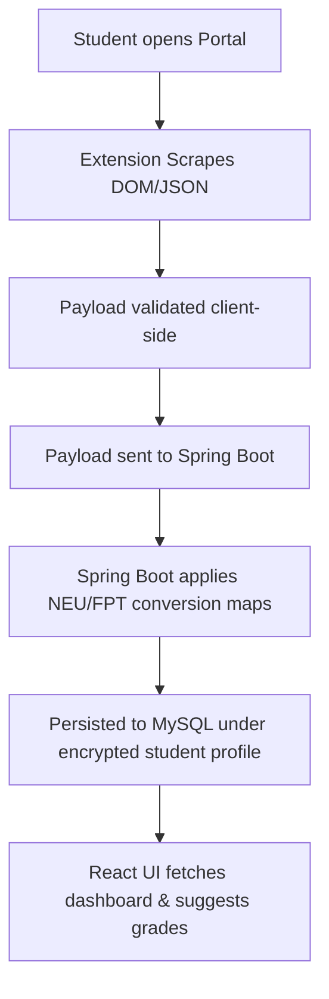

# Software Requirements Specification (SRS) — UniGPA

| Field | Value |
| :--- | :--- |
| Document ID | `GPA-SRS-001` |
| Version / status | 1.0 / Approved |
| Owner / approver | AI Business Analyst / Client |

## Document Version Control

| Version | Date | Author | Reason/change summary | Requirement/sections affected | Reviewer/approver |
| :--- | :--- | :--- | :--- | :--- | :--- |
| 1.0 | 2026-07-18 | AI Business Analyst | Initial version mapped from approved discovery baseline | All | Client |

## Glossary and Terminology

| Term/acronym | Canonical definition | Allowed aliases | Forbidden/ambiguous usage | Owner/source |
| :--- | :--- | :--- | :--- | :--- |
| GPA | Grade Point Average, cumulative academic performance index on a 4.0 scale. | Cumulative GPA | Score | MoET Standard |
| Scraper | Chrome extension component that extracts student transcripts from portals. | Crawler | Scraper plugin | AI Delivery Vendor |
| Roadmap | Projected list of semesters and courses toward graduation goals. | Study Plan | Graduation pathway | Product Owner |
| Leaderboard | Anonymous ranking system comparing GPA percentiles. | Ranking | Scoreboard | Product Owner |

## 1. Purpose and Scope

- **Problem/outcomes:** Provides Vietnamese university students (FPT & NEU) with a Chrome Extension to quickly scrape academic records, and a Web Dashboard to simulate grades, set targets, and view suggested grades per remaining course.
- **In scope:** 
  - Chrome Extension DOM scraping and API JSON interception on portal.
  - Spring Boot Backend REST APIs for auth, profiles, transcripts, simulations, and rankings.
  - React JS frontend interface.
  - Hybrid suggestion algorithm incorporating subject difficulty and category historical performance.
  - Anonymous Major & Intake Year percentiles.
- **Out of scope:** Background crawling using stored credentials; support for non-FPT/NEU portals.
- **Release boundary:** MVP Release 1.0.

## 2. Actors and System Context

| Actor ID | Actor | Goal | Permission boundary | Frequency/context |
| :--- | :--- | :--- | :--- | :--- |
| `ACT-GPA-001` | Student | Crawl academic record, plan goals, simulate grades, view major ranks. | Access to their own data only. Leaderboard shows anonymous statistics. | Daily or weekly during exams. |
| `ACT-GPA-002` | Admin | Manage universities list, audit system logs. | Full access to backing server database. | Monthly. |

## 3. Business Process

## 4. Business Requirements and Rules

| ID | Requirement/Rule | Source | Priority | Rationale | Acceptance Summary |
| :--- | :--- | :--- | :--- | :--- | :--- |
| `BR-GPA-001` | Convert FPT grades: 8.5-10 ➔ A(4), 7.0-8.4 ➔ B(3), 5.5-6.9 ➔ C(2), 4.0-5.4 ➔ D(1), <4.0 ➔ F(0). | Client / OQ-GPA-009 | Must | Follow FPT standard. | Mapped values exact. |
| `BR-GPA-002` | Convert NEU grades: 8.5-10 ➔ A(4), 8.0-8.4 ➔ B+(3.5), 7.0-7.9 ➔ B(3), 6.5-6.9 ➔ C+(2.5), 5.5-6.4 ➔ C(2), 4.0-5.4 ➔ D(1), <4.0 ➔ F(0). | Client / OQ-GPA-009 | Must | Follow NEU standard. | Mapped values exact. |
| `BR-GPA-003` | Leaderboard **SHALL NOT** disclose real names or Student IDs. | Client / OQ-GPA-011 | Must | Privacy compliance. | Only show percentile and anonymous avatar. |
| `BR-GPA-004` | Extension **SHALL NOT** request or save student passwords. | Client / OQ-GPA-013 | Must | Security isolation. | Scrapes while user is logged in. |

## 5. Functional Requirements

| ID | Capability/Behavior | Actor/Trigger | Input/Output | Priority | Acceptance |
| :--- | :--- | :--- | :--- | :--- | :--- |
| `FR-GPA-001` | Scrape raw grades table via Chrome Extension popup button. | Student triggers on grades page. | Input: Active DOM table/JSON response. Output: Standardized JSON payload. | Must | Given student is on FAP or NEU grades page, when they click scrape, then the DOM is correctly parsed and validated. |
| `FR-GPA-002` | Save transcript payload to Spring Boot backend. | Chrome Extension calls POST `/api/transcripts`. | Input: JSON transcript payload. Output: `201 Created` with transcript ID. | Must | Given valid auth token and payload, when API is called, then the database saves normalized grades under user account. |
| `FR-GPA-003` | Perform target GPA calculation and suggest grades. | React FE requests `/api/transcripts/{id}/roadmap?targetGpa=3.6`. | Input: target GPA. Output: list of suggested grades per remaining course. | Must | Given target cumulative GPA, when requested, then returns suggested grades based on course difficulty weights and category history. |
| `FR-GPA-004` | Calculate Major and Intake Year anonymous rankings. | Spring Boot background cron or triggers. | Input: student cumulative GPAs. Output: percentile rank. | Must | Given student GPA 3.5, SE major, K18 intake, when ranking requested, then returns Top 5%. |
| `FR-GPA-005` | Persist multiple transcripts/simulations per user. | User requests new simulation profile. | Input: profile label. Output: new empty/cloned simulation profile. | Must | User can create, rename, or delete simulation profiles. |
| `FR-GPA-006` | Sync Google OAuth token to create user session. | React FE Google login success trigger. | Input: Google OAuth credential token. Output: JWT token and user session details. | Must | Generates new user row in database on first login. |
| `FR-GPA-007` | Modify simulated grades on UI and recalculate. | User changes grade dropdown on React Web table. | Input: Grade selected (e.g. A to B). Output: Recalculated projected GPA displayed instantly on UI. | Must | Instantly recalculates cumulative GPA using core formula. |
| `FR-GPA-008` | Edit subject difficulty level for remaining courses. | User clicks "Easy/Hard/Medium" tags on course row. | Input: difficulty level. Output: Skews target grade suggestions (Easy = higher grade target, Hard = lower grade target). | Must | Suggestions update to balance cumulative goal. |

## 6. Use Cases

| ID | Title | Primary actor | Main outcome | Alternate/error | Linked FR |
| :--- | :--- | :--- | :--- | :--- | :--- |
| `UC-GPA-001` | Scrape grades from portal | Student | Transcript imported and standard course list saved. | Scraper layout mismatch ➔ Alert user to update extension. | `FR-GPA-001`, `FR-GPA-002` |
| `UC-GPA-002` | Generate target roadmap | Student | View required grades list to achieve target cumulative GPA. | Goal mathematically unreachable ➔ Prompt user to adjust target GPA. | `FR-GPA-003`, `FR-GPA-008` |
| `UC-GPA-003` | Simulate semester grades | Student | Recalculate cumulative GPA dynamically by altering specific grades. | Invalid inputs ➔ Reject change. | `FR-GPA-007` |

## 7. Non-Functional Requirements

| ID | Category | Target | Measurement | Environment | Priority |
| :--- | :--- | :--- | :--- | :--- | :--- |
| `NFR-PERF-001` | Latency p95 | Suggestion algorithm response time ≤ 2.0 seconds. | API performance test tools (JMeter). | Staging/Prod | Must |
| `NFR-SEC-001` | Authorization | Secure all `/api/transcripts/**` endpoints via JWT validate. | Integration tests calling without token ➔ Reject with 401. | All | Must |
| `NFR-SEC-002` | Encryption | Encrypt student email and transcripts at rest in MySQL using AES-256. | Database dump inspection check. | Production | Must |
| `NFR-PRV-001` | Privacy | Clear account option MUST wipe all linked transcripts and logs. | POST `/api/users/me/delete` ➔ Zero user rows left in DB. | All | Must |

## 7A. Security, Privacy and Regulatory Requirements

- **Security Profile:** `HIGH`
- **Security/risk owner:** AI Delivery Vendor / Security Architect
- **Risk appetite and release boundary:** Zero tolerance for credential leaks (no credentials stored) or plaintext transcript exposure.
- **Regulatory applicability assessment:** Aligned with **Vietnam Decree 13/2023/ND-CP** (GDPR equivalent).
- **Linked threat model:** [THREAT_MODEL.md](file:///e:/template_BRD/AI_PROJECT_LIFECYCLE_TEMPLATE/03-Architecture-Design/THREAT_MODEL.md)

## 8. Data Requirements

| Data ID | Entity/field | Owner/source | Classification | Validation | Retention/delete/export |
| :--- | :--- | :--- | :--- | :--- | :--- |
| `DATA-GPA-001` | User Account Info (Email, Name) | Google Auth / User | PII | Matches valid email format. | Retained until account deleted. |
| `DATA-GPA-002` | Academic Transcripts (Course, Credits, Grade) | SIS Scraper | Confidential | Credits > 0; Grade in ALLOWLIST (A..F). | Retained until account/profile deleted. |

## 9. Integration Requirements

| INT ID | System | Direction/protocol | Auth | SLA/failure behavior | Owner |
| :--- | :--- | :--- | :--- | :--- | :--- |
| `INT-GPA-001` | Google OAuth API | Inbound HTTPS REST | OAuth 2.0 Token | If Google Auth is down, fall back to email registration or show maintenance alert. | Google Identity |

## 9A. External Interface Requirements

### User Interface

| ID | Persona/screen/journey | Inputs/actions | Exact behavior/error/accessibility | Design-system/reference | Test |
| :--- | :--- | :--- | :--- | :--- | :--- |
| `UI-REQ-001` | Dashboard GPA Track | View progress circular charts and stats. | Show GPA on scale 4 and scale 10. WCAG color contrast AA. | Tailwind design | `TC-UI-001` |
| `UI-REQ-002` | Scraper Chrome Popup | Click "Scrape" on extension popup. | Show loading spinner ➔ sync status ➔ success check. | Chrome Extension | `TC-UI-002` |

### Hardware Interface
`N/A` - Web app does not interact directly with hardware devices.

### Software Interface

| ID | Provider/consumer | API/event/file + version | Schema/auth/quota | SLA/timeout/retry/fallback | Test |
| :--- | :--- | :--- | :--- | :--- | :--- |
| `SW-REQ-001` | Chrome Extension to Backend | POST `/api/transcripts` | JSON payload / Auth: JWT bearer token | Timeout 10s. Retry 3 times. Fallback: Show offline notice. | `TC-INT-001` |

### Communications Interface

| ID | Flow/network zones | Protocol/port/DNS | TLS/certificate/auth | Timeout/retry/bandwidth | Test |
| :--- | :--- | :--- | :--- | :--- | :--- |
| `COM-REQ-001` | Extension/Client to Backend | HTTPS / Port 443 / TLS 1.3 | Strict certificate validation / Google JWT Auth | Timeout 10s / retry 3 times | `TC-COM-001` |

## 10. Constraints, Assumptions, and Dependencies

| ID | Type | Content | Validation/owner | Impact |
| :--- | :--- | :--- | :--- | :--- |
| `CON-GPA-001` | Constraint | Must use React JS, Spring Boot, MySQL. | Client | Mandatory tech selections. |
| `DEP-GPA-001` | Dependency | Extension relies on FPT FAP portal page HTML tables. | Tech Lead | Portal changes break scraping. |

## 11. Acceptance and Release Criteria

- **UAT personas/scenarios:** Scraper flow test on mock portal screens, target grade suggestions correctness, leaderboard aggregation.
- **Blocking defect threshold:** Zero critical defects, zero open security vulnerabilities.
- **Required evidence:** Test reports verifying GPA calculations, Scraper success validation logs.
- **Approval authority:** Client Product Owner.

## 12. Open Items
None.
