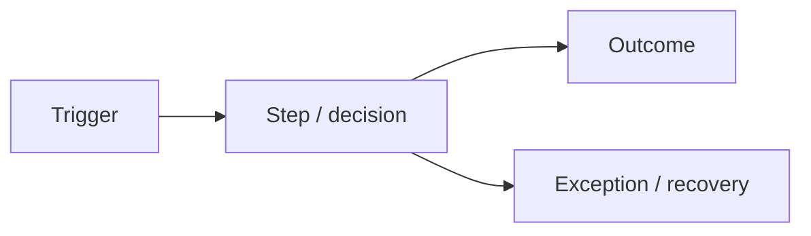

# Software Requirements Specification — {{PROJECT_NAME}}

| Field | Value |
| :--- | :--- |
| Document ID | `{{PROJECT_CODE}}-SRS-001` |
| Version / status | {{VERSION}} / {{STATUS}} |
| Owner / approver | {{OWNER}} / {{PRODUCT_OWNER}} |

## Document Version Control

| Version | Date | Author | Reason/change summary | Requirement/sections affected | Reviewer/approver |
| :--- | :--- | :--- | :--- | :--- | :--- |
| 0.1 | {{DATE}} | {{AUTHOR}} | Initial draft | All | Pending |

Do not modify or delete historical versions. Baseline changes must link to a CR/decision and update the RTM.

## Glossary and Terminology

| Term/acronym | Canonical definition | Allowed aliases | Forbidden/ambiguous usage | Owner/source |
| :--- | :--- | :--- | :--- | :--- |
| {{TERM}} | {{DEFINITION}} | {{ALIASES_OR_NONE}} | {{FORBIDDEN_TERMS}} | {{OWNER_SOURCE}} |

## 1. Purpose and Scope

- Problem/outcomes: {{SUMMARY}}
- In scope: {{IN_SCOPE}}
- Out of scope: {{OUT_OF_SCOPE}}
- Release boundary: {{RELEASE_BOUNDARY}}

## 2. Actors and System Context

| Actor ID | Actor | Goal | Permission boundary | Frequency/context |
| :--- | :--- | :--- | :--- | :--- |
| ACT-001 | {{ACTOR}} | {{GOAL}} | {{BOUNDARY}} | {{CONTEXT}} |

## 3. Business Process

## 4. Business Requirements and Rules

Each normative row must contain exactly one obligation using **SHALL** or **SHALL NOT**. Recommendation/permission must use **SHOULD** or **MAY** and must not be mixed with mandatory acceptance.

| ID | Requirement/Rule | Source | Priority | Rationale | Acceptance Summary |
| :--- | :--- | :--- | :--- | :--- | :--- |
| BR-001 | Client/business **SHALL** {{ONE_ATOMIC_OBLIGATION}} | Q-Cxxx / STK-xxx | Must | {{WHY}} | {{EXACT_ACCEPTANCE}} |

## 5. Functional Requirements

Do not combine two independent verification behaviors with "and/or"; split the IDs and link dependencies.

| ID | Capability/Behavior | Actor/Trigger | Input/Output | Priority | Acceptance |
| :--- | :--- | :--- | :--- | :--- | :--- |
| FR-001 | System **SHALL** {{ONE_ATOMIC_BEHAVIOR}} | {{ACTOR_TRIGGER}} | {{IO}} | Must | Given/When/Then with exact expected result |

## 6. Use Cases / User Stories

| ID | Title | Primary actor | Main outcome | Alternate/error | Linked FR |
| :--- | :--- | :--- | :--- | :--- | :--- |
| UC-001 | {{TITLE}} | {{ACTOR}} | {{OUTCOME}} | {{ALTERNATE}} | FR-001 |

## 7. Non-Functional Requirements

Do not use terms like "maximum security", "absolute safety", "fast", "no side effects", or specific design patterns as targets. Each NFR must have a subject, threshold, measurement method, environment, and pass/fail evidence.

| ID | Category | Target | Measurement | Environment | Priority |
| :--- | :--- | :--- | :--- | :--- | :--- |
| NFR-PERF-001 | Latency p95 | {{TARGET}} | {{METHOD}} | {{ENV}} | Must |
| NFR-SEC-001 | Authorization | {{TARGET}} | {{METHOD}} | All | Must |
| NFR-REL-001 | Availability/RTO/RPO | {{TARGET}} | {{METHOD}} | Production | Must |

## 7A. Security, Privacy and Regulatory Requirements

- Security Profile: `STANDARD / HIGH / CRITICAL`
- Security/risk owner: {{SECURITY_OWNER}}
- Risk appetite and release boundary: {{RISK_APPETITE}}
- Regulatory applicability assessment: {{APPLICABILITY_REFERENCE}}
- Linked threat model (design phase): `../03-Architecture-Design/THREAT_MODEL.md`

| ID | Atomic Obligation | Asset/Threat/Source | Profile/Applicability | Exact Acceptance/Test |
| :--- | :--- | :--- | :--- | :--- |
| NFR-SEC-001 | System **SHALL** {{ONE_SECURITY_OBLIGATION}} | {{ASSET_THREAT_SOURCE}} | {{PROFILE_SCOPE}} | {{PASS_FAIL_EVIDENCE}} |
| NFR-PRV-001 | System **SHALL** {{ONE_PRIVACY_OBLIGATION}} | {{PURPOSE_LAW_SOURCE}} | {{APPLICABILITY}} | {{PASS_FAIL_EVIDENCE}} |

The SRS records obligations and constraints with their sources. Do not duplicate architecture designs, database schemas, API implementations, or test procedures in requirements. Design responses will be linked later using `ADR / DES / API / DATA / THR` IDs.

## 8. Data Requirements

| Data ID | Entity/field | Owner/source | Classification | Validation | Retention/delete/export |
| :--- | :--- | :--- | :--- | :--- | :--- |
| DATA-001 | {{DATA}} | {{OWNER}} | {{CLASS}} | {{RULE}} | {{LIFECYCLE}} |

## 9. Integration Requirements

| INT ID | System | Direction/protocol | Auth | SLA/failure behavior | Owner |
| :--- | :--- | :--- | :--- | :--- | :--- |
| INT-001 | {{SYSTEM}} | {{PROTOCOL}} | {{AUTH}} | {{SLA_FALLBACK}} | {{OWNER}} |

## 9A. External Interface Requirements

### User Interface

If the project does not have a UI, retain this section and specify `N/A` with a rationale and the approver. Figma, Penpot, MCP, or design-to-code are implementation/design tool options, not default requirements unless business/UX constraints exist.

| ID | Persona/screen/journey | Inputs/actions | Exact behavior/error/accessibility | Design-system/reference | Test |
| :--- | :--- | :--- | :--- | :--- | :--- |
| UI-REQ-001 | {{PERSONA_SCREEN}} | {{INPUT_ACTION}} | {{BEHAVIOR_ERROR_A11Y}} | {{DESIGN_SYSTEM}} | TC-UI-XXX |

### Hardware Interface

| ID | Device/interface | Protocol/driver/version | Capacity/timing | Failure/recovery | Test |
| :--- | :--- | :--- | :--- | :--- | :--- |
| HW-REQ-001 | {{DEVICE_OR_NA}} | {{PROTOCOL}} | {{TARGET}} | {{FAILURE_RECOVERY}} | TC-HW-XXX |

### Software Interface

| ID | Provider/consumer | API/event/file + version | Schema/auth/quota | SLA/timeout/retry/fallback | Test |
| :--- | :--- | :--- | :--- | :--- | :--- |
| SW-REQ-001 | {{SYSTEMS}} | {{CONTRACT}} | {{SCHEMA_AUTH_QUOTA}} | {{RESILIENCE}} | TC-INT-XXX |

### Communications Interface

| ID | Flow/network zones | Protocol/port/DNS | TLS/certificate/auth | Timeout/retry/bandwidth | Test |
| :--- | :--- | :--- | :--- | :--- | :--- |
| COM-REQ-001 | {{FLOW_ZONES}} | {{PROTOCOL_PORT}} | {{SECURITY}} | {{TARGETS}} | TC-COM-XXX |

## 10. Constraints, Assumptions, and Dependencies

| ID | Type | Content | Validation/owner | Impact |
| :--- | :--- | :--- | :--- | :--- |
| CON-001 | Constraint | {{ITEM}} | {{OWNER}} | {{IMPACT}} |

## 11. Acceptance and Release Criteria

- UAT personas/scenarios: {{UAT_SCOPE}}
- Blocking defect threshold: {{THRESHOLD}}
- Required evidence: {{EVIDENCE}}
- Approval authority: {{PRODUCT_OWNER}}

## 12. Open Items

| ID | Question | Owner | Due | Requirement Blocked |
| :--- | :--- | :--- | :--- | :--- |
| OQ-001 | {{QUESTION}} | {{OWNER}} | {{DATE}} | {{IDS}} |
