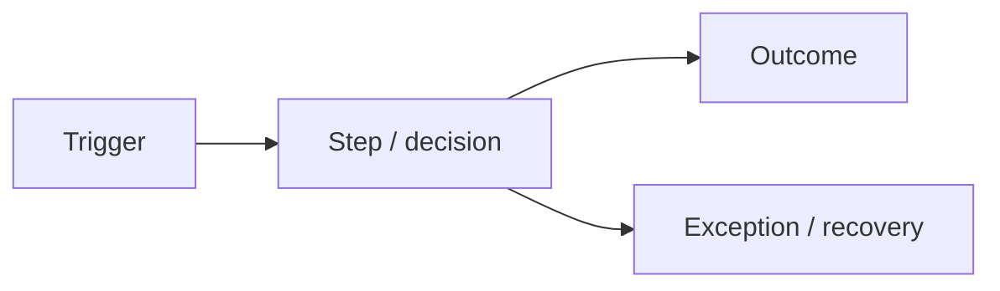

# Software Requirements Specification — {{PROJECT_NAME}}

| Trường | Giá trị |
| :--- | :--- |
| Document ID | `{{PROJECT_CODE}}-SRS-001` |
| Version / status | {{VERSION}} / {{STATUS}} |
| Owner / approver | {{OWNER}} / {{PRODUCT_OWNER}} |

## Document version control

| Version | Date | Author | Reason/change summary | Requirement/sections affected | Reviewer/approver |
| :--- | :--- | :--- | :--- | :--- | :--- |
| 0.1 | {{DATE}} | {{AUTHOR}} | Initial draft | All | Pending |

Không sửa/xóa history cũ. Baseline change phải liên kết CR/decision và cập nhật RTM.

## Glossary and terminology

| Term/acronym | Canonical definition | Allowed aliases | Forbidden/ambiguous usage | Owner/source |
| :--- | :--- | :--- | :--- | :--- |
| {{TERM}} | {{DEFINITION}} | {{ALIASES_OR_NONE}} | {{FORBIDDEN_TERMS}} | {{OWNER_SOURCE}} |

## 1. Purpose và scope

- Problem/outcomes: {{SUMMARY}}
- In scope: {{IN_SCOPE}}
- Out of scope: {{OUT_OF_SCOPE}}
- Release boundary: {{RELEASE_BOUNDARY}}

## 2. Actors và system context

| Actor ID | Actor | Goal | Permission boundary | Frequency/context |
| :--- | :--- | :--- | :--- | :--- |
| ACT-001 | {{ACTOR}} | {{GOAL}} | {{BOUNDARY}} | {{CONTEXT}} |

## 3. Business process

## 4. Business requirements và rules

Mỗi row normative chứa đúng một obligation và dùng `PHẢI/SHALL` hoặc `KHÔNG ĐƯỢC/SHALL NOT`. Recommendation/permission phải dùng `NÊN/SHOULD` hoặc `CÓ THỂ/MAY` và không được trộn với mandatory acceptance.

| ID | Requirement/rule | Source | Priority | Rationale | Acceptance summary |
| :--- | :--- | :--- | :--- | :--- | :--- |
| BR-001 | Business/System **PHẢI** {{ONE_ATOMIC_OBLIGATION}} | Q-Cxxx / STK-xxx | Must | {{WHY}} | {{EXACT_ACCEPTANCE}} |

## 5. Functional requirements

Không gộp hai hành vi verify độc lập bằng `và/hoặc`; tách ID và liên kết dependency.

| ID | Capability/behavior | Actor/trigger | Input/output | Priority | Acceptance |
| :--- | :--- | :--- | :--- | :--- | :--- |
| FR-001 | System **PHẢI** {{ONE_ATOMIC_BEHAVIOR}} | {{ACTOR_TRIGGER}} | {{IO}} | Must | Given/When/Then với expected result cụ thể |

## 6. Use cases / user stories

| ID | Title | Primary actor | Main outcome | Alternate/error | Linked FR |
| :--- | :--- | :--- | :--- | :--- | :--- |
| UC-001 | {{TITLE}} | {{ACTOR}} | {{OUTCOME}} | {{ALTERNATE}} | FR-001 |

## 7. Non-functional requirements

Không dùng “bảo mật mạnh nhất”, “an toàn tuyệt đối”, “nhanh”, “không ảnh hưởng module khác” hoặc tên pattern làm target. Mỗi NFR phải có subject, threshold, measurement, environment và pass/fail evidence.

| ID | Category | Target | Measurement | Environment | Priority |
| :--- | :--- | :--- | :--- | :--- | :--- |
| NFR-PERF-001 | Latency p95 | {{TARGET}} | {{METHOD}} | {{ENV}} | Must |
| NFR-SEC-001 | Authorization | {{TARGET}} | {{METHOD}} | All | Must |
| NFR-REL-001 | Availability/RTO/RPO | {{TARGET}} | {{METHOD}} | Production | Must |

## 7A. Security, privacy và regulatory requirements

- Security Profile: `STANDARD / HIGH / CRITICAL`
- Security/risk owner: {{SECURITY_OWNER}}
- Risk appetite và release boundary: {{RISK_APPETITE}}
- Regulatory applicability assessment: {{APPLICABILITY_REFERENCE}}
- Linked threat model (design phase): `../03-Architecture-Design/THREAT_MODEL.md`

| ID | Atomic obligation | Asset/threat/source | Profile/applicability | Exact acceptance/test |
| :--- | :--- | :--- | :--- | :--- |
| NFR-SEC-001 | Hệ thống **PHẢI** {{ONE_SECURITY_OBLIGATION}} | {{ASSET_THREAT_SOURCE}} | {{PROFILE_SCOPE}} | {{PASS_FAIL_EVIDENCE}} |
| NFR-PRV-001 | Hệ thống **PHẢI** {{ONE_PRIVACY_OBLIGATION}} | {{PURPOSE_LAW_SOURCE}} | {{APPLICABILITY}} | {{PASS_FAIL_EVIDENCE}} |

SRS ghi obligation và constraint có nguồn, không chép architecture, database schema, API implementation hoặc test procedure vào requirement. Design response được liên kết sau bằng `ADR/DES/API/DATA/THR` ID.

## 8. Data requirements

| Data ID | Entity/field | Owner/source | Classification | Validation | Retention/delete/export |
| :--- | :--- | :--- | :--- | :--- | :--- |
| DATA-001 | {{DATA}} | {{OWNER}} | {{CLASS}} | {{RULE}} | {{LIFECYCLE}} |

## 9. Integration requirements

| INT ID | System | Direction/protocol | Auth | SLA/failure behavior | Owner |
| :--- | :--- | :--- | :--- | :--- | :--- |
| INT-001 | {{SYSTEM}} | {{PROTOCOL}} | {{AUTH}} | {{SLA_FALLBACK}} | {{OWNER}} |

## 9A. External interface requirements

### User Interface

Nếu dự án không có UI, giữ mục này và ghi `N/A` kèm rationale/approver. Figma, Penpot, MCP hoặc design-to-code là implementation/design tool option, không phải requirement mặc định nếu chưa có business/UX constraint.

| ID | Persona/screen/journey | Inputs/actions | Exact behavior/error/accessibility | Design-system/reference | Test |
| :--- | :--- | :--- | :--- | :--- | :--- |
| UI-REQ-001 | {{PERSONA_SCREEN}} | {{INPUT_ACTION}} | {{BEHAVIOR_ERROR_A11Y}} | {{DESIGN_SYSTEM}} | TC-UI-XXX |

### Hardware Interface

| ID | Device/interface | Protocol/driver/version | Capacity/timing | Failure/recovery | Test |
| :--- | :--- | :--- | :--- | :--- | :--- |
| HW-REQ-001 | {{DEVICE_OR_NA}} | {{PROTOCOL}} | {{TARGET}} | {{FAILURE_RECOVERY}} | TC-HW-XXX |

### Software Interface

| ID | Provider/consumer | API/event/file + version | Schema/auth/quota | SLA/timeout/retry/fallback | Test |
| :--- | :--- | :--- | :--- | :--- | :--- |
| SW-REQ-001 | {{SYSTEMS}} | {{CONTRACT}} | {{SCHEMA_AUTH_QUOTA}} | {{RESILIENCE}} | TC-INT-XXX |

### Communications Interface

| ID | Flow/network zones | Protocol/port/DNS | TLS/certificate/auth | Timeout/retry/bandwidth | Test |
| :--- | :--- | :--- | :--- | :--- | :--- |
| COM-REQ-001 | {{FLOW_ZONES}} | {{PROTOCOL_PORT}} | {{SECURITY}} | {{TARGETS}} | TC-COM-XXX |

## 10. Constraints, assumptions, dependencies

| ID | Type | Nội dung | Validation/owner | Impact |
| :--- | :--- | :--- | :--- | :--- |
| CON-001 | Constraint | {{ITEM}} | {{OWNER}} | {{IMPACT}} |

## 11. Acceptance và release criteria

- UAT personas/scenarios: {{UAT_SCOPE}}
- Blocking defect threshold: {{THRESHOLD}}
- Required evidence: {{EVIDENCE}}
- Approval authority: {{PRODUCT_OWNER}}

## 12. Open items

| ID | Câu hỏi | Owner | Due | Requirement blocked |
| :--- | :--- | :--- | :--- | :--- |
| OQ-001 | {{QUESTION}} | {{OWNER}} | {{DATE}} | {{IDS}} |
