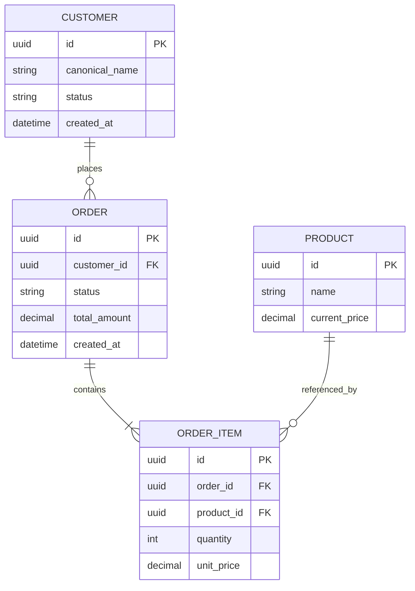

# Data Model & Entity Relationship Diagram — {{PROJECT_NAME}}

| Field | Value |
| :--- | :--- |
| Document ID | `{{PROJECT_CODE}}-ERD-001` |
| Version / status | {{VERSION}} / {{STATUS}} |
| Owner / reviewer | {{OWNER}} / {{REVIEWER}} |
| Requirements | {{DATA_BR_FR_NFR_IDS}} |

## Version History

| Version | Date | Author | Reason/change | Entities/migrations affected |
| :--- | :--- | :--- | :--- | :--- |
| 0.1 | {{DATE}} | {{AUTHOR}} | Initial draft | All |

## Conceptual/Logical ERD

Replace example entities with the actual domain. All relationships must have cardinality, optionality, and business invariants.

## Entity Catalog

| Entity | Responsibility/Source of Truth | Primary/Alternate Keys | Lifecycle/States | Owner | Requirement |
| :--- | :--- | :--- | :--- | :--- | :--- |
| {{ENTITY}} | {{RESPONSIBILITY_SOURCE}} | {{KEYS}} | {{LIFECYCLE}} | {{OWNER}} | FR/BR-XXX |

## Data Dictionary

| Entity.field | Type/format | Required/default | Validation/constraint/index | Classification | Retention/delete/export | API/Test |
| :--- | :--- | :--- | :--- | :--- | :--- | :--- |
| `{{ENTITY.FIELD}}` | {{TYPE_FORMAT}} | {{REQUIRED_DEFAULT}} | {{RULE_INDEX}} | Public / Internal / Confidential / PII / Sensitive | {{LIFECYCLE}} | API/TC-XXX |

## Relationship and Integrity Rules

| Rule ID | Relationship/Invariant | Enforcement | Failure/Error | Verification |
| :--- | :--- | :--- | :--- | :--- |
| DATA-RULE-001 | {{CARDINALITY_INVARIANT}} | DB / Domain / Both | {{ERROR}} | TC-DATA-XXX |

## State and Temporal Rules

| Entity | State/Transition | Allowed Actor/Condition | Audit/History | Test |
| :--- | :--- | :--- | :--- | :--- |
| {{ENTITY}} | {{FROM_TO}} | {{ACTOR_CONDITION}} | {{AUDIT}} | TC-STATE-XXX |

## Migration, Compatibility and Recovery

- Current ➔ target schema: {{MIGRATION}}
- Backfill/volume/throttling: {{BACKFILL}}
- Forward/backward compatibility: {{COMPATIBILITY}}
- Backup/restore/rollback: {{RECOVERY}}
- Reconciliation/data quality checks: {{CHECKS}}

## Review Checklist

- [ ] Entity/field/relationship terminology matches BRD/SRS/API/test/glossary.
- [ ] Keys, uniqueness, nullability, referential integrity, and concurrency are defined.
- [ ] PII/sensitive fields have defined owner, purpose, retention, delete/export, and audit.
- [ ] Migration/rollback/compatibility and test evidence have a designated owner.
