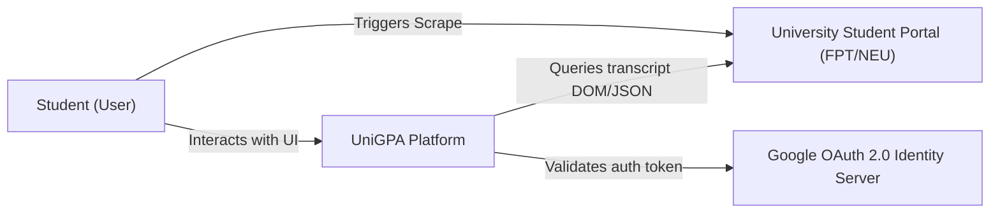
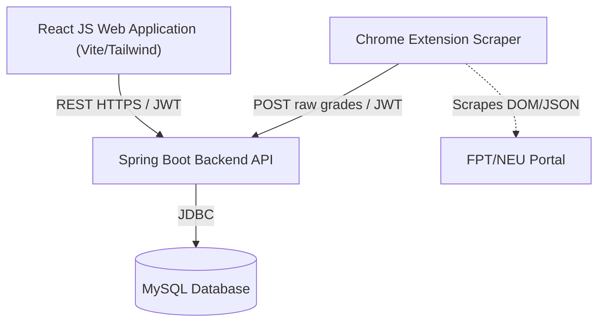
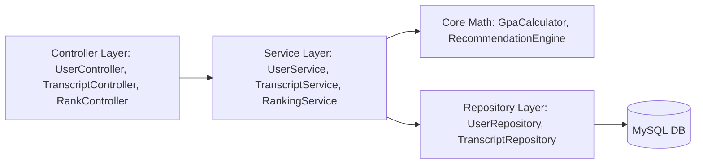
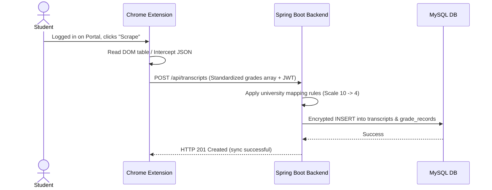
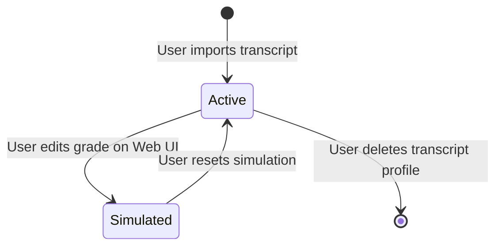

# Software Architecture — UniGPA

| Field | Value |
| :--- | :--- |
| Document ID | `GPA-SAD-001` |
| Version / status | 1.0 / Approved |
| Owner / reviewers | AI Solution Architect / Client |

## 1. Architecture Drivers

| Driver | Linked Requirement | Target/Constraint | Design Response |
| :--- | :--- | :--- | :--- |
| Resilient scraper | `FR-GPA-001` | Parse DOM & capture JSON safely | Chrome Extension executing client-side with fallback HTML parsers. |
| Hybrid Suggestions | `FR-GPA-003` | Recalculate GPA using difficulty & history | Java backend processing calculations, served via REST API to React FE. |
| Anonymized ranks | `FR-GPA-005` | Filter by major/intake, no names leaked | SQL group-by queries on anonymous profiles returning only percentiles. |
| Security HIGH profile | `NFR-SEC-002` | Protect student transcripts (PII) | Encrypted database records for sensitive fields using AES-256. |

## 2. System Context (C4 L1)

| Actor/System | Responsibility | Protocol/Data | Trust/Owner |
| :--- | :--- | :--- | :--- |
| Student | Uses the platform to simulate grades, set targets, and trigger scrapes. | UI interaction | Untrusted / Client |
| UniGPA Platform | Orchestrates grade calculation, suggestions, rankings, and stores transcripts. | HTTPS REST API | Trusted / AI Delivery Vendor |
| University Portal | Hosts student transcripts and course catalog. | HTTPS / HTML, JSON | External / FPT & NEU |
| Google OAuth | Validates user identity and returns security tokens. | OpenID Connect / JWT | External / Google |

## 3. Containers (C4 L2)

| Container | Responsibility | Technology/Constraint | Data | Scale/Deploy |
| :--- | :--- | :--- | :--- | :--- |
| React Web UI | Displays dashboard, simulator, and roadmaps. | Vite, React JS, Tailwind CSS | Local state, LocalStorage | Static hosting (Vercel/S3) |
| Chrome Extension | Scrapes student portal grades locally and forwards to backend. | manifest V3, Content Scripts | In-memory raw transcript | Chrome Developer Load (Unpacked) |
| Spring Boot API | Handles authentication, profile management, grade conversion, calculations, and rankings. | Java 17, Spring Boot 3.x, Spring Security | JSON REST API Payload | Containerized (Docker/AWS ECS) |
| MySQL DB | Persists user records, transcripts, courses, and rank caches. | MySQL 8.x | Encrypted transcripts, user credentials | Managed MySQL instance (RDS) |

## 4. Components (C4 L3)

- **Allowed dependency direction:** Controllers ➔ Services ➔ Repositories/Math engines. Circular dependencies are forbidden.
- **Shared-kernel rule:** Common GPA calculation utilities and mappings reside in a shared core module.

## 5. Runtime Views

### Critical Sequence: Sync Transcript via Extension

### State Model of Simulation Profile

## 6. Data Architecture

| Entity/Store | Owner/Source of Truth | Classification | Consistency | Retention/Backup |
| :--- | :--- | :--- | :--- | :--- |
| User Profile | Spring Boot Backend | PII | Strong | Daily backup, delete on user request |
| Grade Record | Spring Boot Backend | PII / Academic | Strong | Daily backup, delete on user request |
| Ranking Cache | Spring Boot Backend | Internal | Eventual | Recalculate daily, no backup needed |

## 7. Interfaces

| Interface ID | Consumer/Provider | Contract/Version | Auth | Timeout/retry/idempotency | Failure/Fallback |
| :--- | :--- | :--- | :--- | :--- | :--- |
| `DES-API-001` | Extension ➔ Backend | POST `/api/transcripts` v1 | Bearer JWT | 10s / 3 retries | Alert user to retry manually |
| `DES-API-002` | React FE ➔ Backend | GET `/api/transcripts/{id}/roadmap` v1 | Bearer JWT | 5s / 2 retries | Display last cached roadmap |

## 8. Security, Privacy, and Threat Controls

- **Identity/session:** Google OAuth 2.0 authentication. Server issues short-lived JWT session tokens.
- **Authorization:** Method-level security (`@PreAuthorize`) in Spring Boot checking user ownership of transcript records.
- **Secret/key management:** Database encryption keys stored in AWS Systems Manager Parameter Store or environment variables. No raw secrets in repo.
- **Encryption:** AES-256 encryption at database layer for email, names, and grade tables.
- **Audit/abuse prevention:** Rate-limiting via Spring Cloud Gateway or Bucket4j for `/api/transcripts` endpoints.

## 9. Quality Attributes

| NFR | Scenario | Target | Architecture Tactic | Verification |
| :--- | :--- | :--- | :--- | :--- |
| `NFR-PERF-001` | Fetch suggestion roadmap | Latency ≤ 2.0s for p95 at 100 concurrent users | In-memory GPA math pre-computations and index caching | JMeter load test |
| `NFR-SEC-002` | Access other student's data | HTTP 403 Forbidden | JPA repository enforces ownership boundary checks | QA authorization tests |

## 10. Deployment and Operations
CI/CD pipeline compiles Spring Boot as a Docker container, runs tests, and deploys to AWS ECS (Fargate). Frontend is deployed as static files to AWS S3 / CloudFront.

## 11. Architecture Decision Records (ADRs)

| ADR | Decision | Status | Requirement | Risk/Trade-Off |
| :--- | :--- | :--- | :--- | :--- |
| `ADR-GPA-001` | Local Session-based Scraping | Approved | `BR-GPA-004` | Extension must run while student session is active, cannot pull grades in background. |
| `ADR-GPA-002` | MySQL for Database Store | Approved | `CON-GPA-004` | Solid relational database support, standard schemas, easy transaction borders. |
