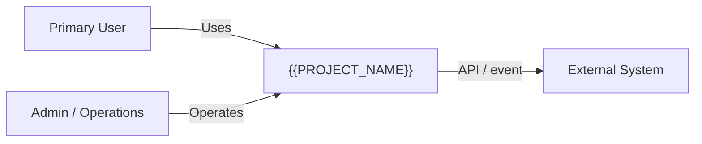
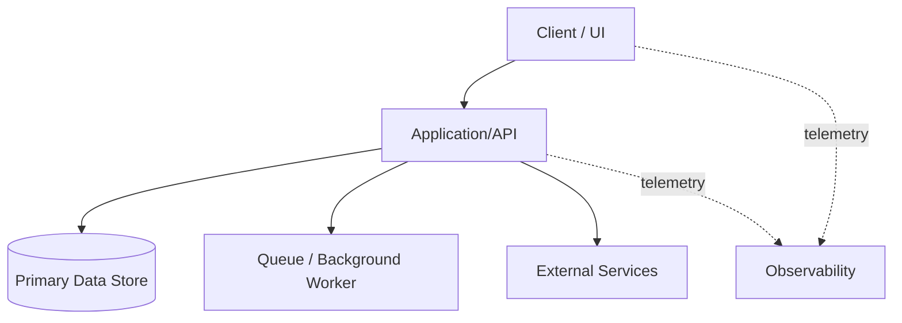
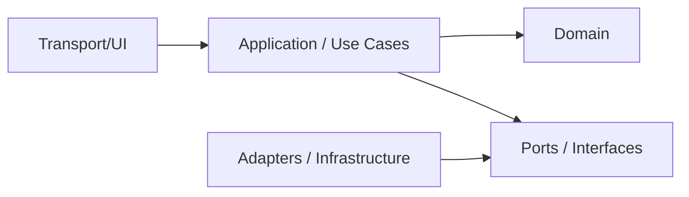
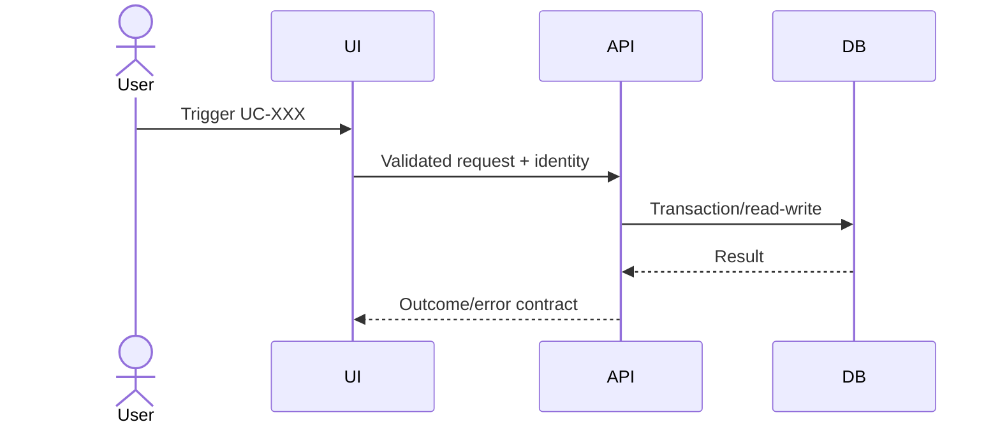
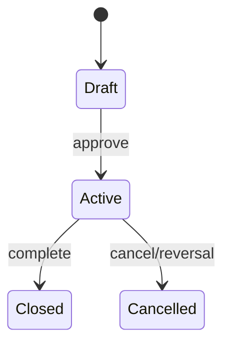
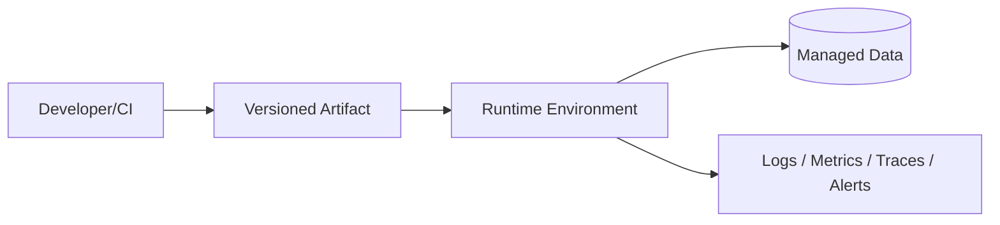

# Software Architecture — {{PROJECT_NAME}}

| Trường | Giá trị |
| :--- | :--- |
| Document ID | `{{PROJECT_CODE}}-SAD-001` |
| Version / status | {{VERSION}} / {{STATUS}} |
| Owner / reviewers | {{TECH_LEAD}} / {{REVIEWERS}} |

## 1. Architecture drivers

| Driver | Linked requirement | Target/constraint | Design response |
| :--- | :--- | :--- | :--- |
| Business capability | FR-XXX | {{TARGET}} | {{RESPONSE}} |
| Performance/reliability/security | NFR-XXX | {{TARGET}} | {{RESPONSE}} |

## 2. System context (C4 L1)

| Actor/system | Responsibility | Protocol/data | Trust/owner |
| :--- | :--- | :--- | :--- |
| {{ACTOR_SYSTEM}} | {{RESPONSIBILITY}} | {{PROTOCOL_DATA}} | {{TRUST_OWNER}} |

## 3. Containers (C4 L2)

| Container | Responsibility | Technology/constraint | Data | Scale/deploy |
| :--- | :--- | :--- | :--- | :--- |
| {{CONTAINER}} | {{RESPONSIBILITY}} | {{TECH}} | {{DATA}} | {{SCALE}} |

## 4. Components và dependency rules (C4 L3)

- Allowed dependency direction: {{RULE}}
- Module ownership/bounded contexts: {{CONTEXTS}}
- Shared-kernel rule: {{RULE}}

## 5. Runtime views

### Critical sequence

### State model

## 6. Data architecture

| Entity/store | Owner/source of truth | Classification | Consistency | Retention/backup |
| :--- | :--- | :--- | :--- | :--- |
| {{ENTITY}} | {{OWNER}} | {{CLASS}} | {{CONSISTENCY}} | {{LIFECYCLE}} |

- Transaction boundaries: {{BOUNDARIES}}
- Migration/versioning: {{STRATEGY}}
- Cache/index/partition: {{STRATEGY}}
- Audit/reconciliation: {{STRATEGY}}

## 7. Interfaces

| Interface ID | Consumer/provider | Contract/version | Auth | Timeout/retry/idempotency | Failure/fallback |
| :--- | :--- | :--- | :--- | :--- | :--- |
| DES-API-001 | {{PARTIES}} | {{CONTRACT}} | {{AUTH}} | {{RESILIENCE}} | {{FALLBACK}} |

## 8. Security, privacy và threat controls

- Identity/session: {{DESIGN}}
- Authorization/policy enforcement: {{DESIGN}}
- Secret/key management: {{DESIGN}}
- Encryption and data minimization: {{DESIGN}}
- Audit/abuse prevention: {{DESIGN}}
- Linked threat model: `THREAT_MODEL.md`

## 9. Quality attributes

| NFR | Scenario | Target | Architecture tactic | Verification |
| :--- | :--- | :--- | :--- | :--- |
| NFR-PERF-001 | {{SCENARIO}} | {{TARGET}} | {{TACTIC}} | {{TEST}} |
| NFR-REL-001 | {{SCENARIO}} | {{TARGET}} | {{TACTIC}} | {{TEST}} |

## 10. Deployment và operations

- Environment/config promotion: {{STRATEGY}}
- Health/readiness and SLI: {{STRATEGY}}
- Capacity/cost guardrails: {{TARGET}}
- Backup/restore/failover: {{STRATEGY}}

## 11. ADR và risks

| ADR | Decision | Status | Requirement | Risk/trade-off |
| :--- | :--- | :--- | :--- | :--- |
| ADR-001 | {{DECISION}} | Proposed | NFR-XXX | {{TRADEOFF}} |

## 12. Open questions

| ID | Question | Owner | Due | Blocked design/work item |
| :--- | :--- | :--- | :--- | :--- |
| OQ-DES-001 | {{QUESTION}} | {{OWNER}} | {{DATE}} | {{IDS}} |
