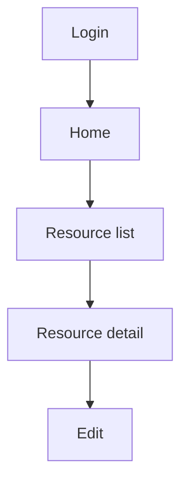

# UI/UX Specification — {{PROJECT_NAME}}

| Field | Value |
| :--- | :--- |
| UI scope | Web / Mobile / Desktop / None |
| Version/status | {{VERSION}} / {{STATUS}} |
| Product/design owner | {{PRODUCT_OWNER}} / {{DESIGN_OWNER}} |
| Accessibility target | WCAG 2.2 AA / Tailored / N/A rationale |

## Screen Inventory

| Screen ID | Name/persona | Entry/exit | Primary task | States | Data/permission | Responsive breakpoints | WCAG evidence | Requirement/test |
| :--- | :--- | :--- | :--- | :--- | :--- | :--- | :--- | :--- |
| SCR-001 | {{SCREEN}} / {{PERSONA}} | {{ENTRY_EXIT}} | {{TASK}} | loading/empty/error/success | {{DATA_PERMISSION}} | {{BREAKPOINTS}} | {{WCAG_EVIDENCE}} | US/FR/TC-UI-XXX |

## Navigation and Information Architecture

| Navigation ID | From ➔ to | Trigger | Guard/permission | Back/deep-link behavior | Analytics/audit | Test |
| :--- | :--- | :--- | :--- | :--- | :--- | :--- |
| NAV-001 | {{FROM}} ➔ {{TO}} | {{TRIGGER}} | {{GUARD}} | {{BACK_DEEPLINK}} | {{ANALYTICS}} | TC-UI-XXX |

## Wireframe and Interaction Evidence

| Journey | Wireframe/prototype path | Content/state review | Keyboard/focus | Screen reader/name | Contrast/zoom | Reviewer/date |
| :--- | :--- | :--- | :--- | :--- | :--- | :--- |
| {{JOURNEY}} | {{WIREFRAME_PATH}} | {{STATE_REVIEW}} | {{FOCUS}} | {{SCREEN_READER}} | {{CONTRAST_ZOOM}} | {{REVIEWER_DATE}} |

## Accessibility Verification

- [ ] Keyboard-only traversal and visible focus are tested.
- [ ] Form labels, errors, status messages, and headings are programmatically associated.
- [ ] Color is not the sole signal; contrast and text resizing are tested.
- [ ] Reduced motion and responsive behavior are tested on target devices.
- [ ] Evidence is linked to screen IDs and test cases.
