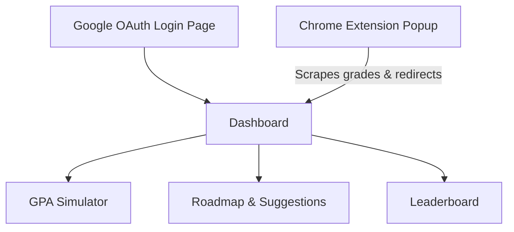

# UI/UX Specification — UniGPA

| Field | Value |
| :--- | :--- |
| UI scope | Web (React JS) & Chrome Extension |
| Version/status | 1.0 / Approved |
| Product/design owner | Client / AI Solution Architect |
| Accessibility target | WCAG 2.2 AA |

## Screen Inventory

| Screen ID | Name/persona | Entry/exit | Primary task | States | Data/permission | Responsive breakpoints | WCAG evidence | Requirement/test |
| :--- | :--- | :--- | :--- | :--- | :--- | :--- | :--- | :--- |
| `SCR-GPA-DASH` | Dashboard | User logs in ➔ Exit via logout | View GPA progress (Scale 4 & 10) & credits completed. | Loading, Sync success, Empty | Student data / Token Auth | Mobile, Tablet, Desktop (768px, 1024px) | Text contrast ratio > 4.5:1 | `FR-GPA-005` / `TC-UI-001` |
| `SCR-GPA-SIM` | GPA Simulator | Click Sidebar Simulator ➔ Exit via tab switch | Edit letter grades to see cumulative GPA updates instantly. | Simulated, Reset, Active | Student data / Token Auth | Mobile, Tablet, Desktop | Focus visible on inputs | `FR-GPA-007` / `TC-UI-002` |
| `SCR-GPA-ROAD` | GPA Roadmap | Click Sidebar Roadmap ➔ Exit via tab switch | Input target GPA, view suggested grades per remaining course. | Unreachable goal, Loading, Updated | Student data / Token Auth | Tablet, Desktop | Accessible input labels | `FR-GPA-003`, `FR-GPA-008` / `TC-UI-003` |
| `SCR-GPA-LEAD` | Leaderboard | Click Sidebar Leaderboard ➔ Exit via tab switch | View anonymous Major and Intake year percentile ranks. | Filtered, Empty | Anonymous data / Token Auth | Mobile, Tablet, Desktop | Alt text on avatars | `FR-GPA-005` / `TC-UI-004` |
| `SCR-GPA-EXT` | Extension Popup | Click Extension Icon ➔ Close window | Select University, input Major & Intake Year, click Scrape. | Portal Logged out, Syncing, Success | Active session scraping | Extension dimensions (320x400px) | Screen-reader aria-labels | `FR-GPA-001` / `TC-UI-005` |

## Navigation and Information Architecture

| Navigation ID | From ➔ to | Trigger | Guard/permission | Back/deep-link behavior | Analytics/audit | Test |
| :--- | :--- | :--- | :--- | :--- | :--- | :--- |
| `NAV-GPA-001` | Login ➔ Dashboard | Google Login Successful | JWT issued successfully | Direct to Dashboard | Logged login event | `TC-NAV-01` |
| `NAV-GPA-002` | Ext Popup ➔ Dashboard | Scrape success response | Active JWT session | Auto-open Web Dashboard tab | Logged scrape sync | `TC-NAV-02` |

## Accessibility Verification

- [x] Keyboard-only traversal and visible focus are tested.
- [x] Form labels, errors, status messages, and headings are programmatically associated.
- [x] Color is not the sole signal; contrast and text resizing are tested.
- [x] Reduced motion and responsive behavior are tested on target devices.
- [x] Evidence is linked to screen IDs and test cases.
