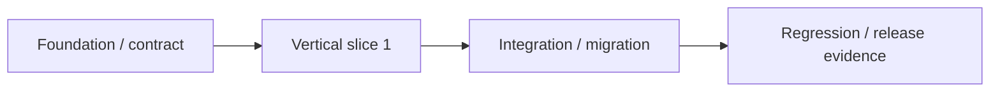

# Implementation Plan — {{PROJECT_NAME}}

## 1. Release objective

- Release: `REL-{{VERSION}}`
- Requirements: {{REQUIREMENT_IDS}}
- Outcome/metric: {{OUTCOME}}
- Non-goals: {{NON_GOALS}}

## 2. Vertical slices

| Slice | Requirement/design | User-visible outcome | Work items | Dependency | Estimate/confidence | Verification |
| :--- | :--- | :--- | :--- | :--- | :--- | :--- |
| VS-001 | FR/DES-XXX | {{OUTCOME}} | WI-001.. | {{DEP}} | {{ESTIMATE}} / H-M-L | {{TEST}} |

## 3. Sequence và critical path

| Step | Entry | Action/output | Exit evidence | Owner |
| :--- | :--- | :--- | :--- | :--- |
| 1 | Gate 03 pass | {{ACTION}} | {{EVIDENCE}} | {{OWNER}} |

## 4. Environment/readiness

| Need | Status | Owner | Due | Fallback |
| :--- | :--- | :--- | :--- | :--- |
| Runtime/dependencies | Ready / Blocked | {{OWNER}} | {{DATE}} | {{FALLBACK}} |
| Test data/access | Ready / Blocked | {{OWNER}} | {{DATE}} | {{FALLBACK}} |

### Human/manual/approval dependencies

| Assistance ID/trigger | Smallest human action | Evidence/output required | AI work continuing | Owner/due |
| :--- | :--- | :--- | :--- | :--- |
| HUM-XXX | {{ACTION}} | {{REFERENCE_NOT_SECRET_VALUE}} | {{CONTINUING_WORK}} | {{OWNER_DATE}} |

Không giao toàn bộ work item cho Client nếu chỉ thiếu access, quyết định hoặc bước thủ công nhỏ. Assistance tuân thủ `../00-Governance-Policy/HUMAN_AI_COLLABORATION_PROTOCOL.md`.

## 5. Quality plan

- Required checks: build / format / lint / type / static / dependency/security.
- Security Profile/checks: {{PROFILE_AND_REQUIRED_CHECKS}}
- Coverage targets theo layer/risk/tool/exclusion: {{COVERAGE_TAILORING}}
- Test layers: {{TEST_PLAN}}
- NFR verification: {{NFR_PLAN}}
- Review/approvers: {{REVIEWERS}}

## 6. Release controls

- Feature flags: {{FLAGS}}
- Migration/compatibility: {{PLAN}}
- Smoke/monitoring: {{PLAN}}
- Rollback trigger/owner: {{PLAN}}

## 7. Risks và open decisions

| ID | Risk/decision | Impact | Action | Owner | Blocks |
| :--- | :--- | :--- | :--- | :--- | :--- |
| RISK/WI-001 | {{ITEM}} | {{IMPACT}} | {{ACTION}} | {{OWNER}} | {{SLICE}} |
