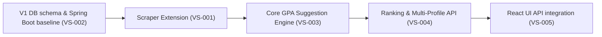

# Implementation Plan — UniGPA

## 1. Release Objective

- **Release:** `REL-1.0` (MVP)
- **Requirements:** `FR-GPA-001` to `FR-GPA-008`, `BR-GPA-001` to `BR-GPA-004`, `NFR-SEC-001`, `NFR-SEC-002`, `NFR-PERF-001`.
- **Outcome/metric:** synched transcripts in < 1 min, correct suggestions calculations, anonymized rankings.
- **Non-goals:** background scraper automation, non-FPT/NEU portal support.

## 2. Vertical Slices

| Slice | Requirement/design | User-visible outcome | Work items | Dependency | Estimate/confidence | Verification |
| :--- | :--- | :--- | :--- | :--- | :--- | :--- |
| `VS-GPA-001` | `FR-GPA-001` / `SCR-GPA-EXT` | Scrape portal grades using Chrome Extension DOM scraping & JSON interception. | WI-GPA-001, WI-GPA-002 | Portal DOM structure | 3 days / High | Manual testing with mock FPT/NEU HTML screens |
| `VS-GPA-002` | `FR-GPA-006`, `NFR-SEC-001` / `GPA-ERD-001` | Spring Boot REST API initialized with Google Login & MySQL schema persistence. | WI-GPA-003, WI-GPA-004 | DB Connection | 4 days / High | JUnit repository tests, Postman API calls |
| `VS-GPA-003` | `BR-GPA-001/002`, `FR-GPA-003` / `GPA-API-001` | Core GPA calculations and hybrid recommendation calculations. | WI-GPA-005 | Backend APIs | 3 days / High | JUnit algorithm math tests |
| `VS-GPA-004` | `FR-GPA-004`, `FR-GPA-005` / `GPA-API-001` | Anonymous Major & Intake year leaderboard rank generation. | WI-GPA-006 | Backend DB | 2 days / High | SQL aggregation tests |
| `VS-GPA-005` | `FR-GPA-007`, `FR-GPA-008` / `SCR-GPA-DASH` | React JS frontend calls backend APIs instead of local storage mocks. | WI-GPA-007, WI-GPA-008 | React FE, Backend | 3 days / High | UI integration tests |

## 3. Sequence and Critical Path

## 4. Environment/Readiness

| Need | Status | Owner | Due | Fallback |
| :--- | :--- | :--- | :--- | :--- |
| Java 17, Maven runtime | Ready | Tech Lead | 2026-07-18 | Use pre-installed JVM |
| Local MySQL 8.0 instance | Ready | Tech Lead | 2026-07-18 | Mock database in H2 database |
| Google OAuth credential key | Ready (Client-provided) | Client | 2026-07-18 | Use mock token bypass configuration in dev mode |

### Human/Manual/Approval Dependencies
None.

## 5. Quality Plan

- **Required checks:** build compilation, checkstyle formatting, spotbugs static analysis, secret scans, unit tests.
- **Security Profile/checks:** HIGH. Enforce Spring Security default-deny, JWT validation, SQL parameterization, AES-256 field converter checks.
- **Coverage targets:** 80% line/branch coverage for service-level GPA algorithms.
- **Test layers:** Unit tests (GPA math), Integration tests (API JWT filters, MySQL persistence), E2E smoke checks.
- **Review/approvers:** Solution Architect / Tech Lead.

## 6. Release Controls

- **Feature flags:** `gpa.features.leaderboard` (toggle leaderboard display).
- **Migration/compatibility:** Liquibase schema updates. Existing React FE fallback to localStorage if Backend is offline.
- **Smoke/monitoring:** Health endpoint `/actuator/health`.
- **Rollback trigger/owner:** Deploy past version on AWS ECS if logs report high 5xx errors or CPU spike.

## 7. Risks and Open Decisions
None.
